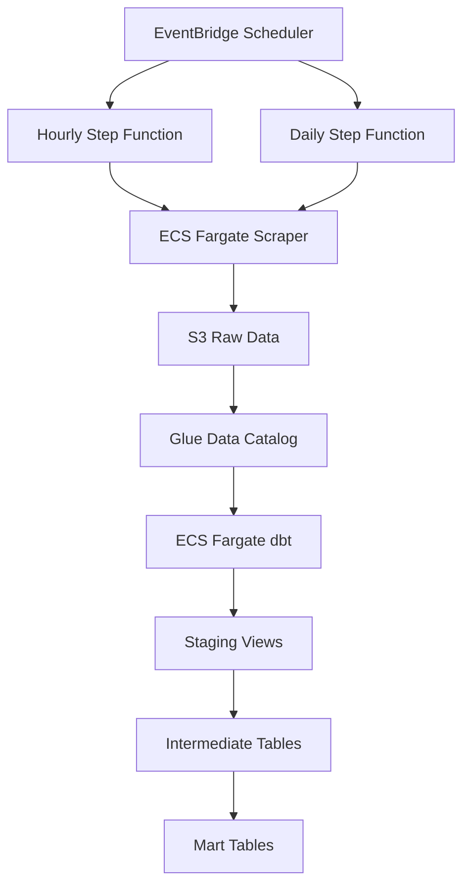

# WHAS 11 Weather Data Platform

An AWS-based weather data platform that ingests hourly and daily weather data scraped from [WHAS 11](https://www.whas11.com/weather/), stores immutable raw data in AWS S3, and transforms it into analytical tables using dbt and AWS Athena.

- **Languages:** Python | SQL | HCL (Terraform)
- **AWS Services:** S3 | Athena | Glue Data Catalog | ECS Fargate | Step Functions
- **Tools:** dbt | Terraform | GitHub Actions
---

## Overview

This data platform scrapes hourly weather forecasts and observations, and daily weather forecasts from [WHAS 11](https://www.whas11.com/weather/) and builds analytical datasets measuring forecasting bias at various forecast time horizons.

- The weather data is scraped using Python and written as immutable JSON records to AWS S3.
- dbt performs SQL transformations in AWS Athena.
- AWS Step Functions orchestrates data ingestion and transformation.
- Terraform provisions the AWS infrastructure.
- GitHub Actions handles CI/CD.

## Architecture

## Key Design Decisions

| Decision | Choice | Rationale |
| -------- | ------ | --------- |
| Raw partition key(s) | `scraped_date` for forecasted weather and `observation_date` for observed weather. | Preserves historical source state (immutable) and enables date filtering downstream. |
| Staging materialization | Views | Avoids persisting data for simple transformations. |
| Intermediate materialization | Tables | Persists reusable derived state for downstream transformations (marts). |
| Downstream table type | Apache Iceberg | Automically discovers new raw partitions upstream unlike Apache Hive tables. |
| Downstream parition key(s) | None | Avoids the "small file problem".
| Data integrity | Pydantic upstream and dbt tests downstream | Python package ensures type safety and dbt ensures `not_null` values. |
| Orchestration | AWS Step Functions | Sequences ingestion and transformation. Managed Workflows for Apache Airflow (MWAA) is a more costly and complex alternative. |
| Compute | AWS ECS Fargate | Runs containerized workloads and scales automatically. |

## Infrastructure

Terraform provisions:

- AWS S3 buckets
- AWS Glue databases and raw tables
- AWS ECR repositories
- AWS ECS cluster and task definitions
- AWS Step Functions state machines
- AWS EventBridge Scheduler schedules
- AWS IAM roles and policies
- AWS CloudWatch log groups
- AWS VPC networking
