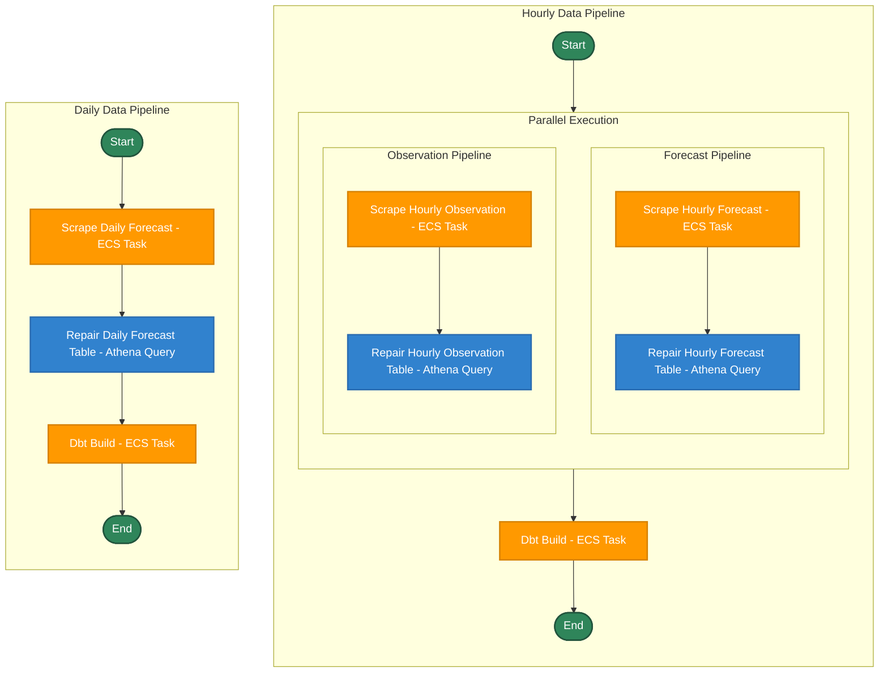

# WHAS 11 Weather Data Platform

An AWS-based weather data platform that ingests hourly and daily weather data scraped from [WHAS 11](https://www.whas11.com/weather/), stores immutable raw data in AWS S3, and transforms it into analytical tables using dbt and AWS Athena.

- **Languages:** Python | SQL | HCL (Terraform)
- **AWS Services:** S3 | Athena | Glue Data Catalog | ECS Fargate | Step Functions
- **Tools:** dbt | Terraform | GitHub Actions
---

## Overview

This data platform scrapes hourly weather forecasts and observations, and daily weather forecasts from [WHAS 11](https://www.whas11.com/weather/) and builds analytical datasets measuring forecasting error at various forecast time horizons.

- The weather data is scraped using Python and written as immutable JSON records to AWS S3.
- dbt facilitates SQL transformations in AWS Athena.
- AWS Step Functions orchestrates data ingestion and transformation.
- Terraform provisions the AWS infrastructure.
- GitHub Actions handles CI/CD.

## Data Pipelines

```mermaid
flowchart TD

    subgraph Hourly_Pipeline [Hourly Data Pipeline]
        direction TB
        
        H_Start([Start]) --> H_Parallel
        
        subgraph H_Parallel [Parallel Execution]
            direction TB

            subgraph Forecast_Branch [Forecast Pipeline]
                direction TB
                ScrapeHourlyForecast[Scrape Hourly Forecast - ECS Task] --> RepairHourlyForecastTable[Repair Hourly Forecast Table - Athena Query]
            end

            subgraph Observation_Branch [Observation Pipeline]
                direction TB
                ScrapeHourlyObservation[Scrape Hourly Observation - ECS Task] --> RepairHourlyObservationTable[Repair Hourly Observation Table - Athena Query]
            end
        end

        H_Parallel --> H_DbtBuild[Dbt Build - ECS Task]
        H_DbtBuild --> H_End([End])
    end

    subgraph Daily_Pipeline [Daily Data Pipeline]
        direction TB
        
        D_Start([Start]) --> ScrapeDailyForecast[Scrape Daily Forecast - ECS Task]
        ScrapeDailyForecast --> RepairDailyForecastTable[Repair Daily Forecast Table - Athena Query]
        RepairDailyForecastTable --> D_DbtBuild[Dbt Build - ECS Task]
        D_DbtBuild --> D_End([End])
    end

    classDef ecs fill:#FF9900,stroke:#D68100,stroke-width:2px,color:#FFF;
    classDef athena fill:#3182CE,stroke:#2B6CB0,stroke-width:2px,color:#FFF;
    classDef terminal fill:#2F855A,stroke:#22543D,stroke-width:2px,color:#FFF;

    class H_Start,H_End,D_Start,D_End terminal;
    class ScrapeHourlyForecast,ScrapeHourlyObservation,H_DbtBuild,ScrapeDailyForecast,D_DbtBuild ecs;
    class RepairHourlyForecastTable,RepairHourlyObservationTable,RepairDailyForecastTable athena;
```

## Key Design Decisions

| Decision | Choice | Rationale |
| -------- | ------ | --------- |
| Raw partition key(s) | `scraped_date` for forecasted weather and `observation_date` for observed weather. | Optimizes scanning by Athena downstream.
| Raw data types for date and time data | String | Enforce predictable JSON serialization upstream (ISO format) and allow downstream tables to handle type conversion. This separation of responsibilities is important due to differences in serialization between systems.
| Downstream partition key(s) | None | Avoids the "small file problem" for data at this scale.
| Fact table materialization | Table | Persist in physical storage to decrease latency for analytical queries.
| Fact table type | Apache Iceberg | Automatically discovers new upstream partitions.
| Data integrity | Pydantic and dbt tests | Former makes format of scrape data predictable and consistent. Latter validates downstream SQL transformations.
| Orchestration | AWS Step Functions | Sequences ingestion and transformation. Managed Workflows for Apache Airflow (MWAA) is a more costly and complex alternative. |
| Raw partition discovery | `MSCK REPAIR TABLE` Step Function state | Ensures up-to-date data downstream automatically.
| Compute | AWS ECS Fargate | Runs containerized workloads and scales automatically. |

## Infrastructure

Terraform provisions:

- AWS S3 buckets
- AWS Glue databases and raw tables
- AWS ECR repositories
- AWS ECS cluster and task definitions
- AWS Step Functions state machines
- AWS EventBridge Scheduler schedules
- AWS IAM roles and policies
- AWS CloudWatch log groups
- AWS VPC networking
